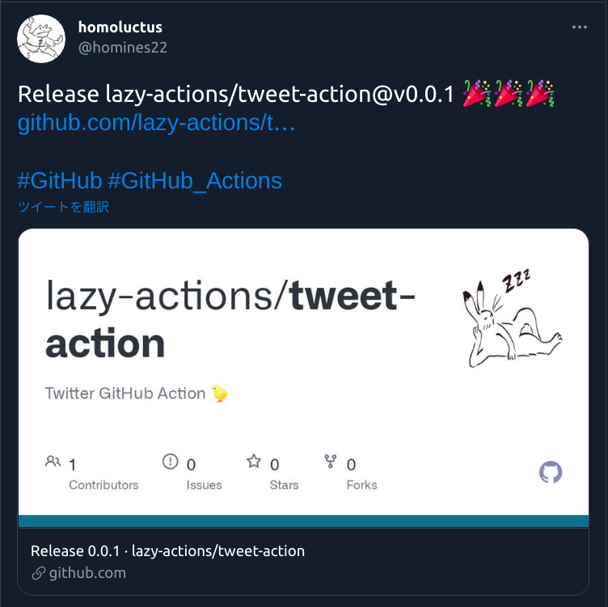

# Tweet Action

<p align="center"></p>
<p align="center">   </p>

## Feature

- Tweet message to Twitter
- User defined custom message
  - Render using [EJS](https://ejs.co/)

## Inputs

|Key|Required|Type|Description|
|:--:|:--:|:--:|:--|
|message|false|string|Plain message to tweet<br>:warning:Cannot be used with `data`, `data_filename`, `template` and `template_filename`|
|data|false|string (JSON)|Parameters to render in template<br>Be sure to specify either `data` or `data_filename`<br>:warning:Cannot be used with `data_filename`|
|data_filename|false|string|Filename where data is saved|
|template|false|string|Template string based on EJS<br>Please refer to [EJS Homepage](https://ejs.co/) for how to write<br>Be sure to specify either `template` or `template_filename`<br>:warning:Cannot be used with `template_filename`|
|template_filename|false|string|Filename where template is written|
|oauth_consumer_key|true|string|API key for OAuth 1.0a<br>See [Twitter Docs](https://developer.twitter.com/en/docs/authentication/oauth-1-0a) for details|
|oauth_consumer_secret|true|string|API secret for OAuth 1.0a<br>See [Twitter Docs](https://developer.twitter.com/en/docs/authentication/oauth-1-0a) for details|
|oauth_token|true|string|Access token for OAuth 1.0a<br>See [Twitter Docs](https://developer.twitter.com/en/docs/authentication/oauth-1-0a) for details|
|oauth_token_secret|true|string|Access token secret for OAuth 1.0a<br>See [Twitter Docs](https://developer.twitter.com/en/docs/authentication/oauth-1-0a) for details|

## Example

### Basic usage

```yaml
steps:
  - uses: lazy-actions/tweet-action@main
    with:
      message: Hello World
      oauth_consumer_key: ${{ secrets.OAUTH_CONSUMER_KEY }}
      oauth_consumer_secret: ${{ secrets.OAUTH_CONSUMER_SECRET }}
      oauth_token: ${{ secrets.OAUTH_TOKEN }}
      oauth_token_secret: ${{ secrets.OAUTH_TOKEN_SECRET }}
```

### Use template

```yaml
steps:
  - uses: lazy-actions/tweet-action@main
    with:
      data: |
        {
          "name": "lazy-actions"
        }
      template: 'Hello <%- name %>'
      oauth_consumer_key: ${{ secrets.OAUTH_CONSUMER_KEY }}
      oauth_consumer_secret: ${{ secrets.OAUTH_CONSUMER_SECRET }}
      oauth_token: ${{ secrets.OAUTH_TOKEN }}
      oauth_token_secret: ${{ secrets.OAUTH_TOKEN_SECRET }}
```

### Load template and data from file

```yaml
steps:
  - uses: lazy-actions/tweet-action@main
    with:
      data_filename: tests/fixtures/data.json
      template_filename: tests/fixtures/template.ejs
      oauth_consumer_key: ${{ secrets.OAUTH_CONSUMER_KEY }}
      oauth_consumer_secret: ${{ secrets.OAUTH_CONSUMER_SECRET }}
      oauth_token: ${{ secrets.OAUTH_TOKEN }}
      oauth_token_secret: ${{ secrets.OAUTH_TOKEN_SECRET }}
```

## Actual Example

GitHub Actions Workflow file is [.github/workflows/tweet.yaml](https://github.com/lazy-actions/tweet-action/blob/main/.github/workflows/tweet.yaml). And template file is
[assets/template.ejs](https://github.com/lazy-actions/tweet-action/blob/main/assets/template.ejs)

**Tweet Result** :arrow_down:


